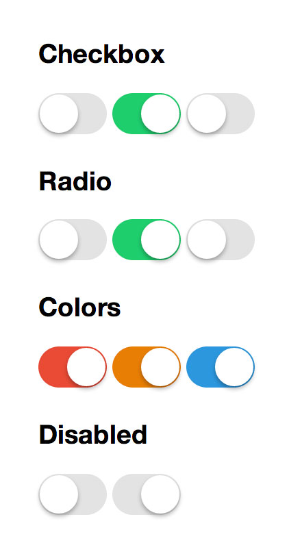

IOS 7 Switches
=============


IOS 7 toggle switches written in pure CSS. No javascript is required.

There are two steps needed.
The first one is to wrap the target input within a div with a switch class.

The second one is to add a label right next to the input.
Note that the "for" attribute on the label tag must match the "id" attribute on the input element. If you forget that, your switches won't toggle.

```xml
<div class="switch">
  <input type="checkbox" id="cb" />
  <label for="cb"></label>
</div>
```

You can also add some color to the switches. Like twitter bootstrap, you also have a switch-(warning | danger | info) class available.

```xml
<div class="switch switch-warning">
  <input type="checkbox" id="cb" />
  <label for="cb"></label>
</div>
```

I didn't test this in all browsers, but apparently works fine in Internet Explorer 9 or higher, Safari 7 and latest versions of Firefox, Chrome and Opera.

Here is jsfiddle [demo](https://rawgit.com/tujamaica/ios7-switches/master/ios7-switches.html).

Hope you like it. Cheers.
